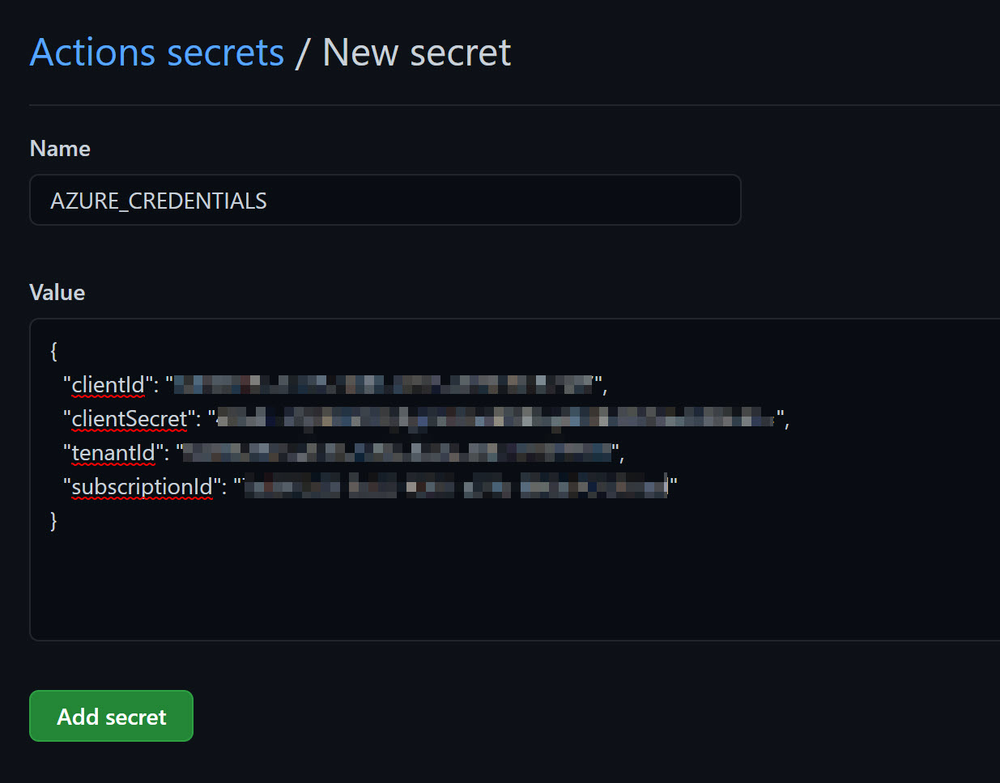
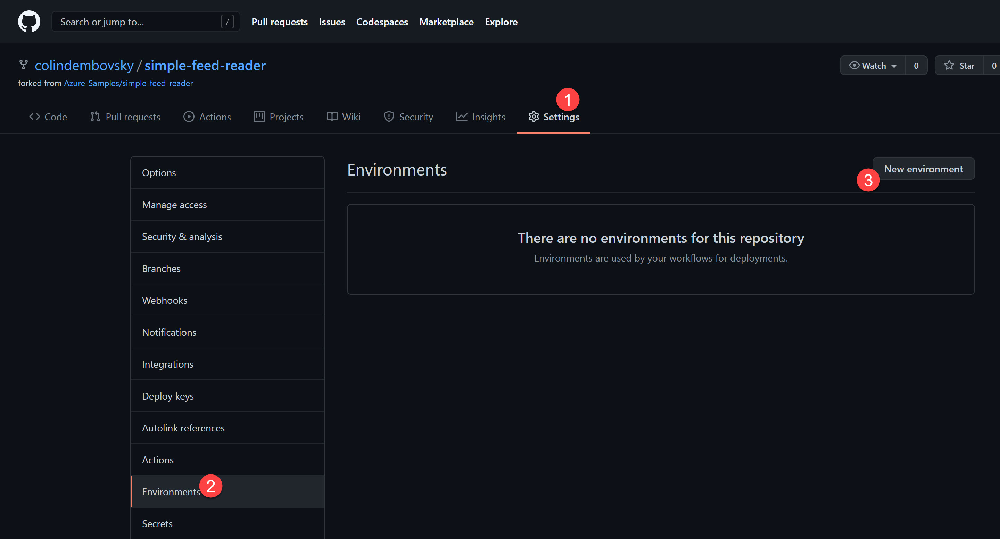
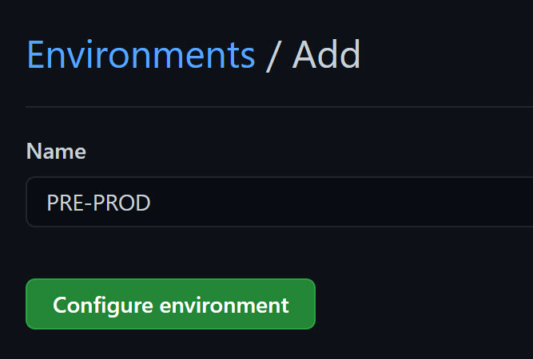
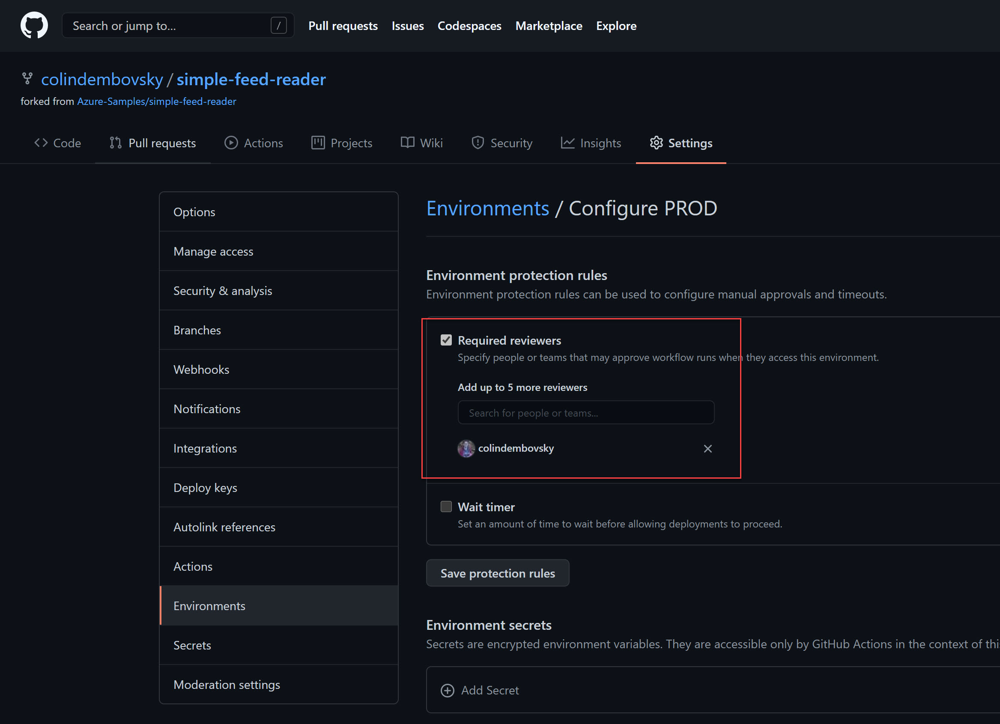
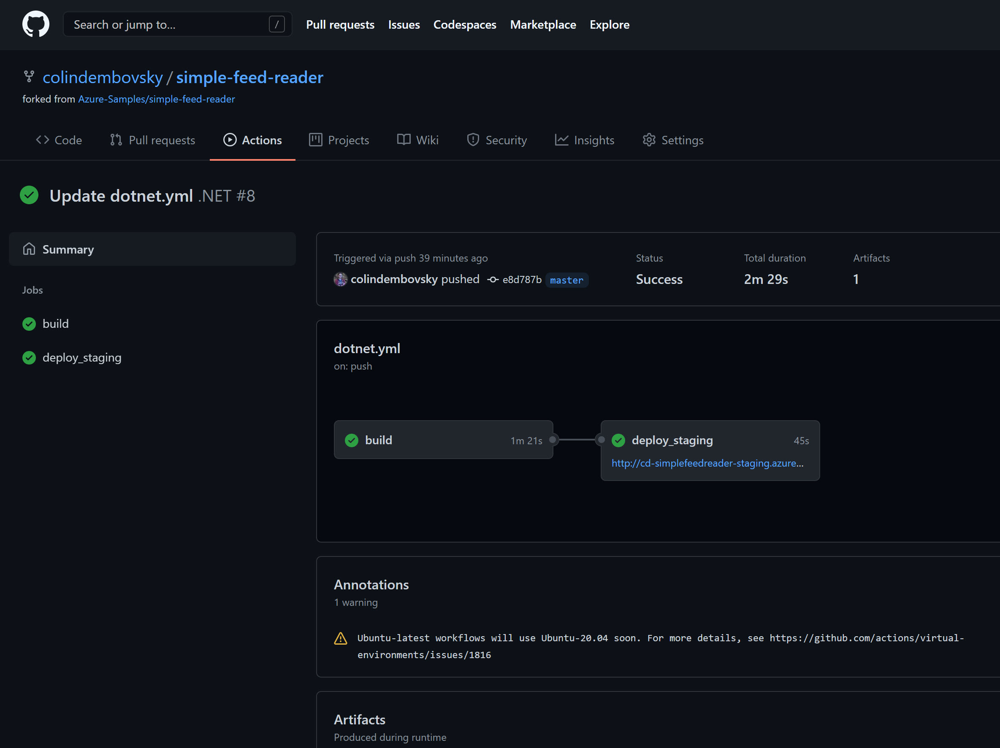
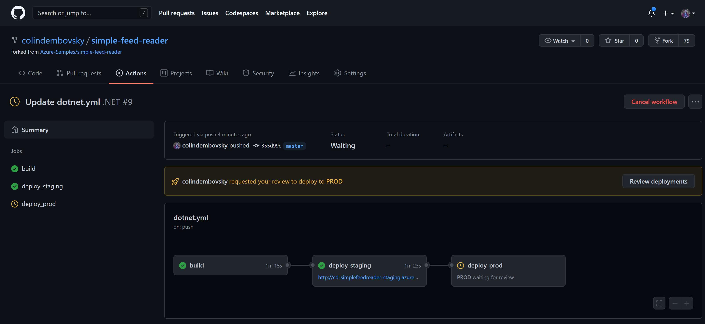
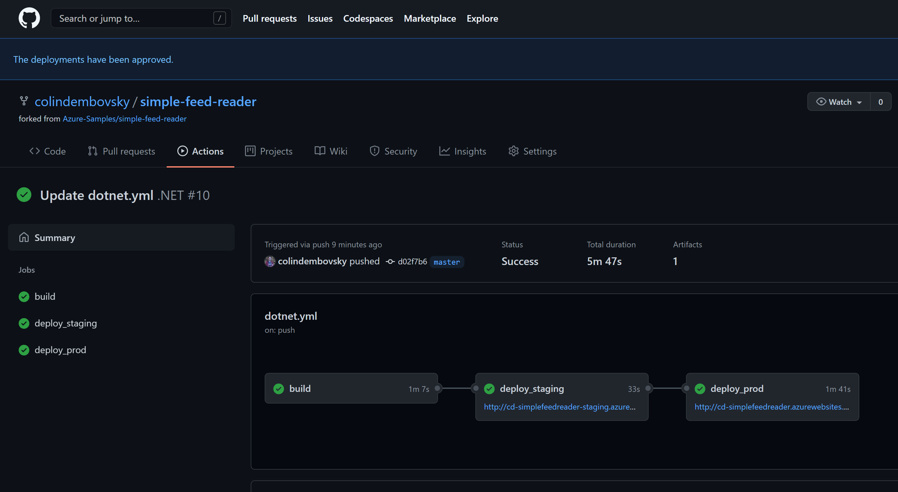
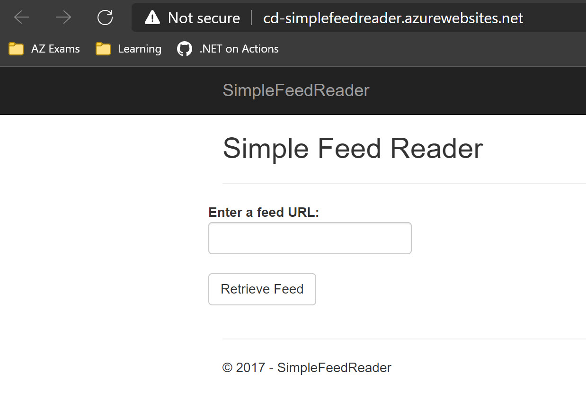
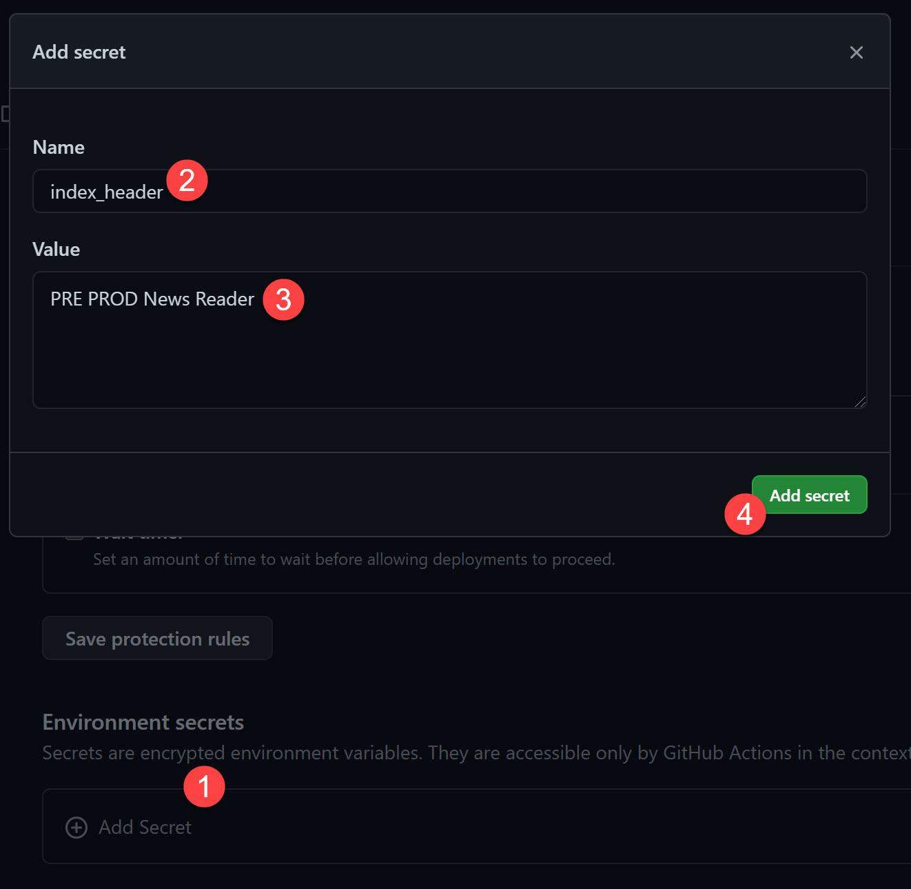

# Deploy a .NET Web App using GitHub Actions

> [!WARNING]
> Please complete the [Build](actions-build.md) tutorial before starting this lab.

In this article, you'll:
> [!div class="checklist"]

> * Learn about Environments in GitHub Actions.
> * Create two environments and specify environment protection rules.
> * Create environment secrets for managing environment-specific configuration.
> * Extend the workflow YAML file to add deployment steps.
> * Add a manual dispatch trigger.

## Environments

Now that you'e published an artifact that is _potentially deployable_, you're going to add _deployment_ jobs to the workflow. There is nothing special about a deployment job, other than the fact that it references an _environment_. Environments are _logical_ constructs that allow you to specify environment protection rules (such as approvals) on any group of resources that you're targeting.

In this walkthrough, you'll be deploying to two environments: `PRE-PROD` and `PROD`. In a typical development lifecylce, you'll want to deploy the latest code to a _soft_ environment (typically `DEV`) that is expected to be a bit unstable. You'll use `PRE-PROD` as this _soft_ environment. The "higher" environments (like `UAT` and `PROD`) are _harder_ environments that are expected to be more stable. To enforce this, you can build protection rules into higher environments. You'll configure an approval protection rule on the `PROD` environment: whenever a deployment job targets an environment with an approval rule, it will pause until approval is granted before executing.

GitHub environments are _logical_ - they represent the physical (or virtual) resources that you're deploying to. In this case, the `PRE-PROD` is just a deployment slot on the Azure Web App. `PROD` is the production slot. The `PRE-PROD` deployment job will deploy the published .NET app to the staging slot, and the `PROD` deplyment job will simply swap the slots.

Once you have these steps in place, you'll update the workflow to handle environment specific configuration using environment secrets.

> [!INFORMATION]
> You can read more about GitHub Actions Environments [here](https://docs.github.com/actions/reference/environments).

> [!NOTE]
> At the time of writing, the GitHub Environments feature is in beta.

## Azure Authentication

To perform actions such as deploying code to an Azure resource, you need the correct permissions. For deployment to Azure Web Apps, you can use a publishing profile. However, if you want to deploy to a staging slot, then you'll need the publishing profile for the slot too. Instead, you can use a service principal (SPN) and assign permission to this service principal. You can then authenticate using credentials for the SPN before using any commands that the SPN has permissions to perform.

Once you have an SPN you'll create a [repository secret](https://docs.github.com/actions/reference/encrypted-secrets) to securely store the credentials. You can then simply refer to the secret whenever you need to authenticate. The secret is encrypted and once it has been saved, can never be viewed or edited (only deleted or re-created).

### Create an SPN

1. In your terminal or Cloud Shell, run the following command to create a Service Principal with `contributor` permissions to the Web App you created earlier:

    ```bash
    az ad sp create-for-rbac --name "{sp-name}" --sdk-auth --role contributor \
    --scopes /subscriptions/{subscription-id}/resourceGroups/{resource-group}/providers/Microsoft.Web/sites/{webappname}
    ```

1. The command should output JSON that has credentials embedded:

    ```yml
    {
      "clientId": "<GUID>",
      "clientSecret": "<GUID>",
      "subscriptionId": "<GUID>",
      "tenantId": "<GUID>",
      ...
    }
    ```

1. Make sure to record the `clientId`, `clientSecret`, `subscription` and `tenantId`. You can also leave the terminal open for copy/paste later.

### Create a Repository Secret

1. Now you're going to create an encrypted secret to store the credentials. You'll create this secret at the repository level.
1. Navigate to GitHub and select your repo `Settings` tab and then select `Secrets`. Select `New repository secret`:

    - 
    **Figure 1**: Create a secret.

1. Copy and paste the JSON from the `az ad sp create-for-rbac` command into the body of the secret. You can create this JSON by hand too if you have the relevant fields for your SPN. The secret should be named `AZURE_CREDENTIALS`. Select `Add secret` to save the new secret:

    - 
    **Figure 2**: Add Azure credentials.

1. You'll consume this secret in a workflow in later steps. To access it, you can use the variable notation `${{}}`. In this case, `${{ AZURE_CREDENTIAL }}` will be populated with the JSON you just saved.

## Adding Environments

[Environments](https://docs.github.com/actions/reference/environments) are used as a _logical boundary_. You can add approvals to environments in order to ensure quality. You can also track deployments to environments and specify environment-specific values (secrets) for configuration.

For this example, you're going to split the actual Azure environment into two _logical_ environments called `PRE-PROD` and `PROD`. When you deploy the web app, you'll deploy to the the staging slot of the web application, represented by the `PRE-PROD` environment. When you're ready to deploy to `PROD`, you'll just perform a slot swap.

In this case, the only difference between the environments is the slot that you're deploying to. In real life, there would typically be different web apps (and separate web app plans), separate resource groups and even separate subscriptions. Typically there is an SPN per environment, so you may want to override the `AZURE_CREDENTIAL` value which you saved as a repository secret by creating it as an _environment secret_.

> [!NOTE]
> Precendence works from Environment to Repo. If a targeted environment has a secret called `MY_SECRET`, then that value is used. If not, the repository value of `MY_SECRET` (if any) is used.

1. Select `Settings` and then `Environments` in your repo. Select `New Environment`:

    - 
    **Figure 3**: Create an environment.

1. Enter `PRE-PROD` and select `Configure environment`:

    - 
    **Figure 4**: Name the environment.

1. Since deploying to a staging slot does not affect the web app, you can safely deploy to the slot without requiring an approval first. Of course you could add a reviewer if you wanted to! For this example, leave the Environment protection rules empty.

> [!NOTE]
> If you target an environment in a workflow and it does not exist, an "empty" environment is created automatically. The environment would look exactly the same as the `PRE-PROD` environment - it would exist, but would not have any protection rules enabled.

1. Select `Environments` again and again select `New Environment`. Now enter `PROD` as the name and select `Configure environment`.

1. Check the `Required reviewers` rule and add yourself as a reviewer. Don't forget to select `Save protection rules`!:

    - 
    **Figure 5**: Add protection rules.

## Deploy to PRE PROD

You can now add additional jobs to the workflow to deploy to the environments! You'll start by adding a deployment to the `PRE-PROD` environment (i.e. the web app staging slot).

1. Navigate to the `.github/workflows/dotnet.yml` file and select the pencil icon to edit the file.
1. You're going to use the web app name a few times in this workflow, and will need the name of the resource group too. You'll define these as variables so that you only have to maintain the value in one place in the workflow file.
1. Add this snippet below the `on` block and above the `jobs` block:

    ```yml
    env:
      app-name: "<name of your web app>"
      rg-name: "<name of your resource group>"

    jobs:    # <-- this is the existing jobs line
    ```

    > [!WARNING]
    > You'll need to replace `<name of your web app>` with the actual name of your web app, and `<name of your resource group>` with the actual name of your resource group.

1. Add a new job below the `build` job as follows:

    ```yml
            if-no-files-found: error  # <-- last line of build job: insert below this line
      
      deploy_staging:
        needs: build
        runs-on: ubuntu-latest
      
        environment:
          name: PRE-PROD
          url: ${{ steps.deploywebapp.outputs.webapp-url }}
        
        steps:
        - name: Download a Build Artifact
          uses: actions/download-artifact@v2.0.8
          with:
            name: website
            path: website
        
        - name: Login via Azure CLI
          uses: azure/login@v1
          with:
            creds: ${{ secrets.AZURE_CREDENTIALS }}
        
        - name: Deploy web app
          id: deploywebapp
          uses: azure/webapps-deploy@v2
          with: 
            app-name: ${{ env.app-name }}
            slot-name: staging
            package: website
        
        - name: az cli logout
          run: az logout
    ```

  Notice the following things:

  1. You're creating a new job called `deploy_staging`
  1. You specify a dependency using `needs`. This job needs the `build` job to complete successfully before it starts.
  1. This job also runs on the latest Ubuntu hosted agent, as specified with the `runs-on` attribute.
  1. You specify that this job is targeting the `PRE-PROD` environment using the `environment` object. You also specify the `url` property - this URL will be displayed in the workflow diagram, giving users an easy way to navigate to the environment. The value of this property is set as the `output` of the `step` with `id` `deploywebapp` which is defined below.
  1. You're executing a `download-artifact` step to download the artifact (compiled web app) from the `build` job.
  1. You then `login` to Azure using the `AZURE_CREDENTIALS` secret you saved earlier. Note the `${{ }}` notation for dereferencing variables.
  1. You then perform a `webapp-deploy`, specifying the `app-name`, `slot-name` and path to the downloaded artifact (`package`). This action also defines an `output` parameter which you use to set the `url` of the environment above.
  1. Finally, you execute a `logout` to logout of the Azure context

1. Commit the file.
1. When the run completes, you should see two successful jobs. The URL for the `PRE-PROD` stage has been set and selecting it will navigate you to your web app staging slot:

    - 
    **Figure 6**: Deployment to PRE-PROD is successful.

1. Notice how the URL contains `-staging` in the name since this is the direct URL to the staging slot:

    - 
    **Figure 7**: The staging slot running.

1. You can also now see deployments. Navigate to `https://{your repo url}/deployments` to view your deployments:

    - 
    **Figure 8**: View deployments.

## Deploy to PROD

Now that you've deployed successfully to `PRE-PROD`, you'll want to deploy to `PROD`. Deployment to `PROD` will be slightly different since you don't need to copy the website again - you just need to swap the `staging` slot with the production slot. you'll do this using an Azure cli (`az`) command.

1. Navigate to the `.github/workflows/dotnet.yml` file and select the pencil icon to edit the file.
1. Add a new job below the `deploy_staging` job as follows:

    ```yml
          run: az logout  # <-- last line of previous job: insert below this line

      deploy_prod:
        needs: deploy_staging
        runs-on: ubuntu-latest
      
        environment:
          name: PROD
          url: ${{ steps.slot_swap.outputs.url }}
        
        steps:
        - name: Login via Azure CLI
          uses: azure/login@v1
          with:
            creds: ${{ secrets.AZURE_CREDENTIALS }}
        
        - name: Swap staging slot into production
          id: slot_swap
          run: |
            az webapp deployment slot swap -g ${{ env.rg-name }} -n ${{ env.app-name }} -s staging
            url=$(az webapp show -g ${{ env.rg-name }} -n ${{ env.app-name }} --query "defaultHostName" -o tsv)
            echo "::set-output name=url::http://$url"
          
        - name: az cli logout
          run: az logout
    ```

Notice the following things:
    1. Once again, you specify a new job `deploy_prod` that `needs` `deploy_staging` to complete before starting.
    1. You're targeting the `PROD` environment this time. Also, the `url` value is different from before.
    1. For the steps, you don't need to download the artifact since you're just going to perform a slot swap. You start by executing a `login` to the Azure context.
    1. The `Swap staging slot into production` step is a multi-line `run` command (note the use of the pipe symbol `|`). You also specify an `id` for this step so that you can refer to it (you refer to it in the `url` property of the `environment`). The first line executes the slot swap using the variables you defined above in the workflow. The second line uses an `az webapp show` command to extract the URL of the target web app. This final line uses `::set-output` in an echo to create an output variable for this task, setting the value to the web app URL.

  > [!NOTE]
  > The URL _must_ start with `http://` or `https://` or it will not render.

1. Commit the file.
1. Let the workflow run for a couple minutes until it has deployed to `PRE-PROD`. At this point the workflow will pause and wait for the required approval since you're targeting the `PROD` environment, which requires an approval as defined earlier:

    - 
    **Figure 9**: Waiting for an approval.

1. Select `Review deployments`, check the `PROD` checkbox, optionally add a comment and then select `Approve and deploy` to start the `PROD` job

    - 
    **Figure 10**: Approve the PROD deployment.

1. The deployment should only take a few seconds. Once it has completed, the URL for the `PROD` environment will update.

    - 
    **Figure 11**: PROD deployment completed.

1. Selecting the `PROD` URL will navigate you to the `PROD` site!

    - 
    **Figure 12**: The PROD site.

## Add a Manual Queue Option

You now have an end-to-end build and deploy workflow, including approvals! One more change you can make is to add a manual trigger to the workflow so that the workflow can be triggered from within the `Actions` tab of the repo.

1. Navigate to the `.github/workflows/dotnet.yml` file and select the pencil icon to edit the file.
1. Add a new trigger between `on` and `push` on lines 3 and 4:

    ```yml
    on:
      workflow_dispatch:   # <-- this is the new line
      push:
    ```

1. The `workflow_dispatch` trigger displays a `Run workflow` button in the `Actions` tab of the repo - _but only if the trigger is defined in the default branch_. However, once this trigger is defined in the workflow, you can select the branch for the run.
1. Commit the file.
1. To see the `Run workflow` button, select the `Actions` tab. Select the `.NET` workflow in the list of workflows. At the top of the list of runs, you'll see the `Run workflow` button. If you select it, you'll be able to select the branch to run the workflow against and queue it:

  - 
  **Figure 13**: Manual dispatch.

## Handle Environment Configuration

Your workflow is deploying the same binary to each environment. This is an important concept to ensure that the binaries you test in one environment are the same that you deploy to the next. However, environments typically have different settings like database connection strings: you want to ensure that the `DEV` application is using `DEV` settings and the `PROD` application is using `PROD` settings!

For this simple application there is no database connection string. However, there is an example configuration setting that you can modify for each environment. If you open the `simple-feed-reader/SimpleFeedReader/appsettings.json` file you'll see that the configuration includes a setting for the Header text on the Index page:

```yml
  "UI": {
    "Index": {
      "Header": "Simple News Reader"
    }
  },
```

To show how environment configuration can be handled, you're going to add a secret to each environment and then substitute that value into the settings as you deploy.

### Add Environment Secrets

1. Select `Settings` on your repository and then `Environments` and select `PRE-PROD`.
1. Select `Add secret` and add a secret called `index_header` with the value `PRE PROD News Reader`. Select `Add secret`.

    - 
    **Figure 14**: Add an environment secret.

1. Repeat these steps to add a secret called `index_header` with the value `PROD News Reader` for the `PROD` environment.
1. If you select `Settings` and `Secrets` in the repo, you'll see the changes. They should look something like this:

    - 
    **Figure 15**: View secrets.

### Update the workflow to handle configuration

1. Navigate to the `.github/workflows/dotnet.yml` file and select the pencil icon to edit the file.
1. Add the following step before the `az cli logout` step in the `deploy_staging` job:

    ```yml
        - name: Update config
          uses: Azure/appservice-settings@v1
          with:
          app-name: ${{ env.app-name }}
          slot-name: staging
          app-settings-json: |
            [
                {
                    "name": "UI:Index:Header",
                    "value": "${{ secrets.INDEX_HEADER }}",
                    "slotSetting": true
                }
            ]
        
        - name: az cli logout   # <-- this exists already
    ```

1. Add almost the same code to the `deploy_prod` job above its `az cli logout` step. The only difference is that you do not specify a `slot-name`, since you're targeting the production slot:

    ```yml
        - name: Update config
          uses: Azure/appservice-settings@v1
          with:
          app-name: ${{ env.app-name }}
          app-settings-json: |
            [
                {
                    "name": "UI:Index:Header",
                    "value": "${{ secrets.INDEX_HEADER }}",
                    "slotSetting": true
                }
            ]
            
        - name: az cli logout # <-- this exists already
    ```

1. Commit the file.
1. Let the workflow run and approve the deployment to `PROD` once the approval is reached.
1. You should see the following headers on the index page for both sites:

    - 
    **Figure 15**: Settings changed in the environments.

## Final Workflow File

The final workflow file should look like this:

```yml
name: .NET

on:
  workflow_dispatch:
  push:
    branches: [ master ]
  pull_request:
    branches: [ master ]

env:
  app-name: "cd-simplefeedreader"
  rg-name: "cd-dotnetactions"

jobs:
  build:

    runs-on: ubuntu-latest

    steps:
    - uses: actions/checkout@v2
    - name: Setup .NET
      uses: actions/setup-dotnet@v1
      with:
        dotnet-version: 2.1.x
    - name: Restore dependencies
      run: dotnet restore
    - name: Build
      run: dotnet build --no-restore
    - name: Test
      run: dotnet test --no-build --verbosity normal
    - name: Publish
      run: dotnet publish SimpleFeedReader/SimpleFeedReader.csproj -c Release -o website
    - name: Upload a Build Artifact
      uses: actions/upload-artifact@v2.2.2
      with:
        name: website
        path: SimpleFeedReader/website/**
        if-no-files-found: error
  
  deploy_staging:
    needs: build
    runs-on: ubuntu-latest
   
    environment:
      name: PRE-PROD
      url: ${{ steps.deploywebapp.outputs.webapp-url }}
    
    steps:
    - name: Download a Build Artifact
      uses: actions/download-artifact@v2.0.8
      with:
        name: website
        path: website
    
    - name: Login via Azure CLI
      uses: azure/login@v1
      with:
        creds: ${{ secrets.AZURE_CREDENTIALS }}
    
    - name: Deploy web app
      id: deploywebapp
      uses: azure/webapps-deploy@v2
      with: 
        app-name: ${{ env.app-name }}
        slot-name: staging
        package: website
    
    - name: Update config
      uses: Azure/appservice-settings@v1
      with:
       app-name: ${{ env.app-name }}
       slot-name: staging
       app-settings-json: |
         [
             {
                 "name": "UI:Index:Header",
                 "value": "${{ secrets.INDEX_HEADER }}",
                 "slotSetting": true
             }
         ]
    
    - name: az cli logout
      run: az logout
      
  deploy_prod:
    needs: deploy_staging
    runs-on: ubuntu-latest
   
    environment:
      name: PROD
      url: ${{ steps.slot_swap.outputs.url }}
    
    steps:
    - name: Login via Azure CLI
      uses: azure/login@v1
      with:
        creds: ${{ secrets.AZURE_CREDENTIALS }}
    
    - name: Swap staging slot into production
      id: slot_swap
      run: |
        az webapp deployment slot swap -g ${{ env.rg-name }} -n ${{ env.app-name }} -s staging
        url=$(az webapp show -g ${{ env.rg-name }} -n ${{ env.app-name }} --query "defaultHostName" -o tsv)
        echo "::set-output name=url::http://$url"
    
    - name: Update config
      uses: Azure/appservice-settings@v1
      with:
       app-name: ${{ env.app-name }}
       app-settings-json: |
         [
             {
                 "name": "UI:Index:Header",
                 "value": "${{ secrets.INDEX_HEADER }}",
                 "slotSetting": true
             }
         ]
         
    - name: az cli logout
      run: az logout

```

>[!div class="step-by-step"]
>[Previous](actions-build.md)
